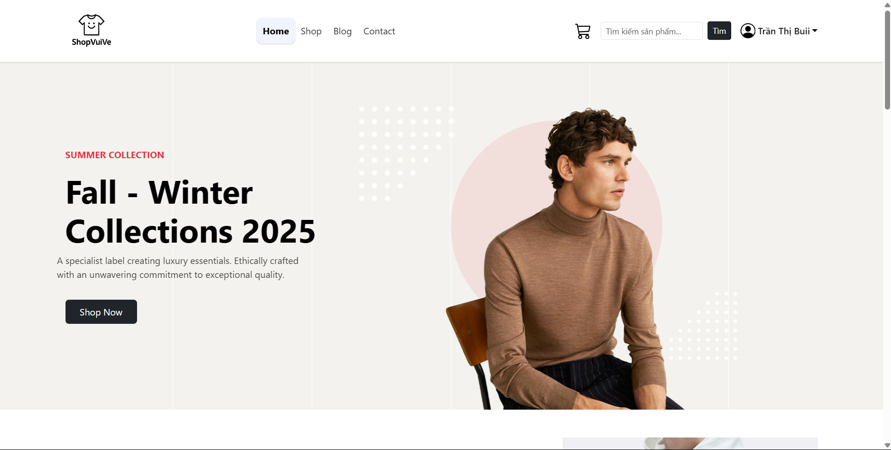

# :tshirt: Dự Án Website Quản Lý/ Mua Bán Quần Áo

## :bust_in_silhouette: Thông Tin Sinh Viên

- Họ và tên: Nguyễn Văn A
- Mã sinh viên: 12345678
- Lớp: K17_CNTT-8
- Môn học: Thiết kế Web nâng cao (COUR01.TH4)

---

## :clipboard: Giới thiệu Project

**Dự án xây dựng một website chuyên về mua bán quần áo, kết nối giữa người quản trị (admin) và người mua (user), mang đến trải nghiệm mua sắm hiện đại, tiện lợi và nhanh chóng.**

- Nhanh chóng  
- Minh bạch  
- Đáng tin cậy  

### :package: Chức năng chính

#### :crown: Chức năng của Admin:

- :bikini: Quản lý danh mục sản phẩm (thêm, sửa, xóa, tìm kiếm danh mục)
- :tshirt: Quản lý sản phẩm (thêm, sửa, xóa, tìm kiếm, phân loại sản phẩm)
- :bust_in_silhouette: Quản lý tài khoản người dùng (xem, phân quyền, sửa, xóa)
- :shopping_cart: Quản lý đơn hàng (xem, duyệt, hủy, cập nhật trạng thái)
- :bar_chart: Xem báo cáo/thống kê doanh thu, số lượng đơn hàng, sản phẩm bán chạy
- :bell: Trả lời phản hồi của người dùng

#### :bust_in_silhouette: Chức năng của Người mua (User):

- :tshirt: Duyệt và tìm kiếm sản phẩm theo tên, danh mục, giá
- :handbag: Thêm sản phẩm vào giỏ hàng, cập nhật/xóa sản phẩm trong giỏ
- :credit_card: Đặt hàng, thanh toán đơn hàng
- :memo: Cập nhật thông tin cá nhân
- :bell: Nhận thông báo từ hệ thống/admin
- :email: Gửi liên hệ/góp ý tới quản trị viên và nhận phản hồi

---

## :computer: Công Nghệ Sử Dụng

| STT | Công nghệ           | Mô tả                                 |
|-----|---------------------|---------------------------------------|
|  1  | PHP (Laravel)       | Framework backend, xử lý logic chính  |
|  2  | MySQL (Aiven Cloud) | Hệ quản trị cơ sở dữ liệu             |
|  3  | Blade Template      | Template engine cho giao diện Laravel |
|  4  | HTML, CSS           | Xây dựng giao diện người dùng         |
|  5  | Bootstrap           | Thiết kế responsive, giao diện

---

## :gear: Cài Đặt

1. Clone Repository
```sh
git clone https://github.com/DANG-NGOC-DUC/ShopThoiTrang.git
cd ShopThoiTrang/BanHang
```

2. Cài Đặt Dependencies PHP
```sh
composer install
```

3. Cấu Hình Environment
```sh
cp .env.example .env
php artisan key:generate
```

4. Khởi Động Development Server
```sh
php artisan serve
```

---
## Tài Khoản Đăng Nhập Mẫu

**1. Tài khoản Admin**  
- **Email:** ductanlang200@gmail.com  
- **Mật khẩu:** 12345678g  

**2. Tài khoản User**  
- **Email:** user@example.com  
- **Mật khẩu:** password  

**Hoặc:**  
- Bạn có thể tự đăng ký một tài khoản mới bằng chức năng Đăng ký trên trang chủ.

---
## :brain: Sơ Đồ

### :file_cabinet: Sơ đồ cơ sở dữ liệu


#### 1. Các bảng chính

- **users**: Lưu thông tin tài khoản người dùng (admin và user): tên, email, mật khẩu, thời gian tạo/cập nhật, v.v.
- **categories**: Quản lý danh mục sản phẩm (ví dụ: áo, quần, váy...).
- **products**: Lưu thông tin sản phẩm: tên, mô tả, giá, hình ảnh, thuộc danh mục nào.
- **carts**: Đại diện cho giỏ hàng của từng user.
- **cart_items**: Lưu chi tiết các sản phẩm trong từng giỏ hàng (sản phẩm nào, số lượng bao nhiêu).
- **orders**: Lưu thông tin đơn hàng của người dùng: tổng tiền, trạng thái, thời gian đặt hàng.
- **order_details**: Lưu chi tiết từng sản phẩm trong đơn hàng (sản phẩm nào, số lượng, giá tại thời điểm đặt).
- **sessions**: Quản lý phiên đăng nhập của người dùng.
- **contacts**: Lưu các phản hồi/góp ý/liên hệ từ người dùng gửi tới admin.

#### 2. Mối quan hệ giữa các bảng

- **users** 1---n **carts**: Mỗi user có thể có nhiều giỏ hàng (thường chỉ 1 giỏ hàng đang hoạt động).
- **carts** 1---n **cart_items**: Mỗi giỏ hàng có nhiều sản phẩm.
- **products** 1---n **cart_items**: Một sản phẩm có thể nằm trong nhiều giỏ hàng khác nhau.
- **categories** 1---n **products**: Một danh mục có nhiều sản phẩm.
- **users** 1---n **orders**: Một user có thể đặt nhiều đơn hàng.
- **orders** 1---n **order_details**: Một đơn hàng có nhiều sản phẩm.
- **products** 1---n **order_details**: Một sản phẩm có thể xuất hiện trong nhiều đơn hàng.
- **users** 1---n **contacts**: Một user có thể gửi nhiều liên hệ/góp ý.
- **users** 1---n **sessions**: Một user có thể có nhiều phiên đăng nhập.

---

### :pushpin: Sơ đồ cấu trúc (Class Diagram)


---

### :pushpin: Sơ đồ thuật toán

- Admin quản lý sản phẩm (CRUD)  
  
- Admin quản lý tài khoản (CRUD)  
  
- Admin quản lý danh sách đơn hàng  
  
- User xem sản phẩm  
  
- User mua hàng, đặt hàng, thanh toán  
  
- User gửi liên hệ  
  

---

## Tổng Quan Kiến Trúc

### Kiến Trúc MVC

**Hệ thống tuân theo mô hình MVC (Model-View-Controller) của Laravel:**

- **Models:** Xử lý logic dữ liệu và tương tác cơ sở dữ liệu
- **Views:** Blade templates để render giao diện người dùng
- **Controllers:** Xử lý yêu cầu người dùng và phối hợp giữa models và views

### Các Thành Phần Chính

- **Controllers**  
  
- **Models**  
  
- **Views**  
  


### :globe_with_meridians: Routes

```php
use App\Http\Controllers\LoginController;
use App\Http\Controllers\RegisterController;
use App\Http\Controllers\AdminUserController;
use App\Http\Controllers\AdminCategoryController;
use App\Http\Controllers\AdminOrderController;
use App\Http\Controllers\AdminProductController;
use App\Http\Controllers\UserHomeController;
use App\Http\Controllers\ProfileController;
use App\Http\Controllers\ShopController;
use App\Http\Controllers\CartController;
use App\Http\Controllers\ContactController;
use App\Http\Controllers\NotificationController;
use App\Http\Controllers\AdminDashboardController;
use Illuminate\Support\Facades\Route;
use Illuminate\Support\Facades\Auth;

// ============login, logout, register=================
Route::get('/', [LoginController::class, 'showLoginForm'])->name('login.form');
Route::post('/login', [LoginController::class, 'login'])->name('login');
Route::post('/logout', function () {
    Auth::logout();
    return redirect()->route('login.form');
})->name('logout');
Route::get('/register', [RegisterController::class, 'showRegistrationForm'])->name('register');
Route::post('/register', [RegisterController::class, 'register'])->name('register.submit');

// =================user=========================
Route::middleware(['auth'])->prefix('user')->group(function () {
    Route::get('/home', [UserHomeController::class, 'index'])->name('user.home');
    Route::get('/profile', [ProfileController::class, 'show'])->name('user.profile');
    Route::put('/profile/{id}', [ProfileController::class, 'update'])->name('user.profile.update');
    Route::get('/shop', [ShopController::class, 'index'])->name('user.shop');
    Route::get('/cart', [CartController::class, 'index'])->name('user.cart');
    Route::put('/cart/{id}', [CartController::class, 'update'])->name('user.cart.update');
    Route::put('/cart/ajax-update/{id}', [CartController::class, 'ajaxUpdate'])->name('user.cart.ajaxUpdate');
    Route::delete('/cart/{id}', [CartController::class, 'remove'])->name('user.cart.remove');
    Route::post('/cart/add', [CartController::class, 'add'])->name('user.cart.add');
    Route::get('/contact', [ContactController::class, 'index'])->name('user.contact');
    Route::post('/contact', [ContactController::class, 'submit'])->name('contact.submit');
    Route::get('/blog', function () {
        return view('user.blog');
    })->name('user.blog');
});

// =================admin=========================
Route::middleware(['auth'])->prefix('admin')->group(function () {
    Route::get('/dashboard', [AdminDashboardController::class, 'index'])->name('admin.dashboard');
    Route::get('/category', [AdminCategoryController::class, 'index'])->name('admin.category');
    Route::post('/category', [AdminCategoryController::class, 'store'])->name('admin.category.store');
    Route::put('/category/{id}', [AdminCategoryController::class, 'update'])->name('admin.category.update');
    Route::delete('/category/{id}', [AdminCategoryController::class, 'destroy'])->name('admin.category.destroy');
    Route::get('/user', [AdminUserController::class, 'index'])->name('admin.user');
    Route::put('/user/{id}', [AdminUserController::class, 'update'])->name('admin.user.update');
    Route::delete('/user/{id}', [AdminUserController::class, 'destroy'])->name('admin.user.destroy');
    Route::get('/order', [AdminOrderController::class, 'index'])->name('admin.order');
    Route::put('/order/{id}', [AdminOrderController::class, 'update'])->name('admin.order.update');
    Route::delete('/order/{id}', [AdminOrderController::class, 'destroy'])->name('admin.order.destroy');
    Route::get('/product', [AdminProductController::class, 'index'])->name('admin.product');
    Route::post('/product', [AdminProductController::class, 'store'])->name('admin.product.store');
    Route::put('/product/{id}', [AdminProductController::class, 'update'])->name('admin.product.update');
    Route::delete('/product/{id}', [AdminProductController::class, 'destroy'])->name('admin.product.destroy');
    Route::get('/notification', [NotificationController::class, 'index'])->name('admin.notification');
    Route::post('/contact-replies', [NotificationController::class, 'storeReply'])->name('contact-replies.store');
});
```
---

## :framed_picture: Giao Diện Chính Website

1. Giao diện Đăng nhập/ Đăng ký

<div style="display: flex; gap: 16px;">
  
  
</div>

2. Giao diện của Admin  
- Thống kê  
  
- Quản lý tài khoản  
  
- Quản lý đơn hàng  
  
- Quản lý sản phẩm  
  
- Quản lý danh mục  
  
- Quản lý thông báo  
  

3. Giao diện của User  
- Trang chủ  
  
- Trang shop  
  
- Trang blog  
  
- Trang contact  
  
- Trang cart  
  
- Trang profile  
  